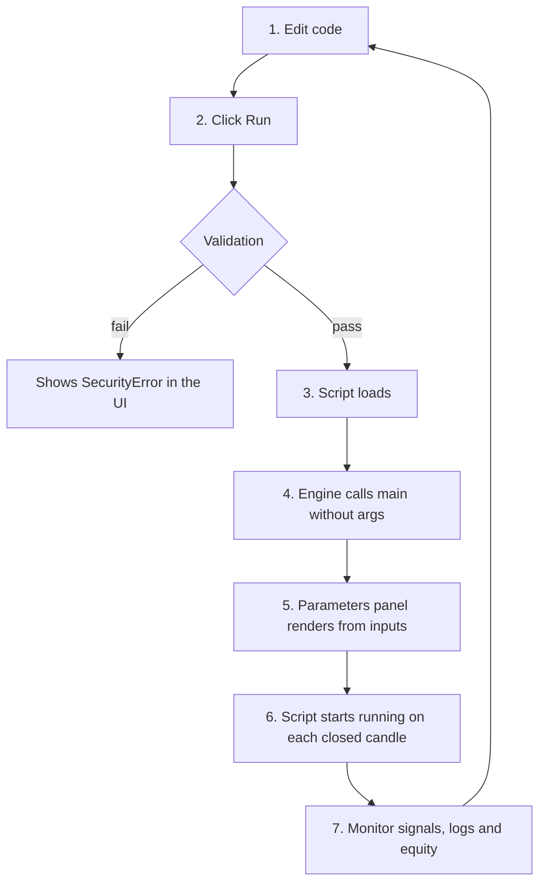

# Live editor

The Chart Trading **Code Editor** is the environment for writing, testing and activating Python scripts directly on the real-time chart. Unlike the backtest, which runs once against history, here the script is loaded and remains coupled to live data.

## Opening the editor

In the Chart Trading panel, click **Editor** (icon `{}`). A side tab opens with:
- Code editing area with syntax highlighting.
- Action buttons: `Run`, `Save`, `Open Docs`.
- Parameters panel (DECLARATION inputs).
- Output tabs: emitted signals, logs (`print()`), errors.

## Initial scaffold

When opening a new script, the editor pre-populates a minimal template, typically the SMA Crossover. The options are:
- Edit the template directly.
- Clear everything and paste custom code.
- Import one of the [ready templates](../strategies/sma-crossover.md).

## Typical work cycle



## Useful shortcuts

| Shortcut | Action |
|---|---|
| `Ctrl + S` | Save script |
| `Ctrl + Enter` | Run |
| `Ctrl + Space` | Autocomplete (if the editor supports it) |
| `F1` | Open docs |

## Real-time output

### "Signals" tab
List of orders issued by the script. Each line shows:
- Timestamp
- Action (`buy_to_open`, `sell_to_close`, etc.)
- Quantity
- Execution price
- Status (pending, executed, rejected)

Clicking a line highlights on the chart the candle on which the order was issued.

### "Logs" tab
Script stdout. Each `print()` generates a line with a timestamp.

Useful for debugging:
```python
def on_bar_strategy(sdk, params):
    rsi = _rsi_last([c["close"] for c in sdk.candles], 14)
    if rsi is not None:
        print(f"[{sdk.candles[-1]['time']}] RSI={rsi:.2f} pos={sdk.position}")
```

### "Errors" tab
Uncaught exceptions are shown with the complete traceback. Validation errors (SecurityError, ProtocolError) appear immediately when Run is clicked, before the script starts.

## Parameters panel

When the script loads, the engine calls `main()` without args and obtains the `DECLARATION`. The parameters panel renders from the declared inputs:

```python
DECLARATION = {
    "inputs": [
        {"name": "period", "label": "Period", "type": "int", "default": 14,
         "min": 1, "max": 100, "step": 1},
    ],
}
```

The input is rendered as a numeric control (stepper) in the UI.

### Live editing

When editing a parameter, the new value arrives in `sdk.params` (and in the `params` arg) on the next call. The script **does not reload**; it only receives the new value.

**Implication:** changing the RSI period from 14 to 21, the new RSI is used on the next candle, but the maintained `sdk.state` (e.g., `rsi_ag`, `rsi_al`) still reflects the smoothing of 14. For a clean reset, click **Run** again (reloads).

## Difference between Run and Save only

- **Save:** persists the code on the backend, but the **old script continues executing**. Useful during editing when observing the running version is desired.
- **Run:** reloads the script; the current version is interrupted and the new one is loaded. Resets all state (`sdk.state`, global variables). Signals already issued remain valid; the new logic is applied from the reset onward.

## Session persistence

An active script keeps running while:
- The Chart Trading tab is open, or
- It is configured as a **paper trading bot** (see [Paper Trading Bots](paper-trading-bots.md)).

If the tab is closed without creating a bot, the script **stops**.

## Multiple simultaneous scripts

The editor supports **a single script at a time** in the UI. To run multiple, use paper bots; each loads its own script in isolation.

## Practical limits of the live editor

| Limit | Behavior on overflow |
|---|---|
| Execution timeout per candle | `TimeoutError` in the log; script stops |
| Memory cap | `MemoryError`; script stops |
| Code size cap | Editor warns; does not run |
| Order submission rate | Safety limits apply to prevent abuse; exceeding them returns HTTP 429 |

Normal scripts do not approach these limits. In case of overflow, review:
- Loops over all candles on every call.
- `pd.DataFrame(sdk.candles)` on every bar.
- Lists growing without control in `sdk.state`.

## Debugging in production

There is no traditional debugger (breakpoint, step-through). Available tools:
1. **`print()`** - records in the Logs tab.
2. **`sdk.state["_debug_last"] = ...`** - stores values for later inspection.
3. **Returning diagnostics in `series`** - add an auxiliary series in `_build_chart` and plot it to visualize the indicator per bar.

### Example - plotting an internal state field

```python
# In _build_chart: recomputes the EMA used incrementally live.
def _build_chart(df, params):
    ...
    debug_plot = {
        "name": "debug_ema", "source": "debug_ema", "type": "line",
        "color": "#FF00FF", "width": 1, "style": "dashed",
    }
    return {
        **DECLARATION,
        "plots": DECLARATION["plots"] + [debug_plot],
        "series": {
            "ma_fast": ...,
            "ma_slow": ...,
            "debug_ema": ema_series(closes, period),  # visual inspection
        },
    }
```

## Updating the script while positions are open

**Caution.** When executing `Run` with an open position:
1. `sdk.state` resets and loses trailing stop, cooldown, etc.
2. The position remains open (the engine keeps it), but the script no longer recognizes the trailing.
3. The new code may decide to close immediately based on different signals.

**Recommendation:** close positions manually before reloading a revised script. Alternatively, design the logic to be **idempotent** with respect to `sdk.position`: the code must handle "I found a position I did not open".

## Next steps

* [Paper Trading Bots](paper-trading-bots.md) - running scripts continuously without an open tab.
* [Live vs backtest differences](live-vs-backtest.md) - subtle execution differences.
* [Example script](../getting-started/example-script.md) - minimal executable version.
