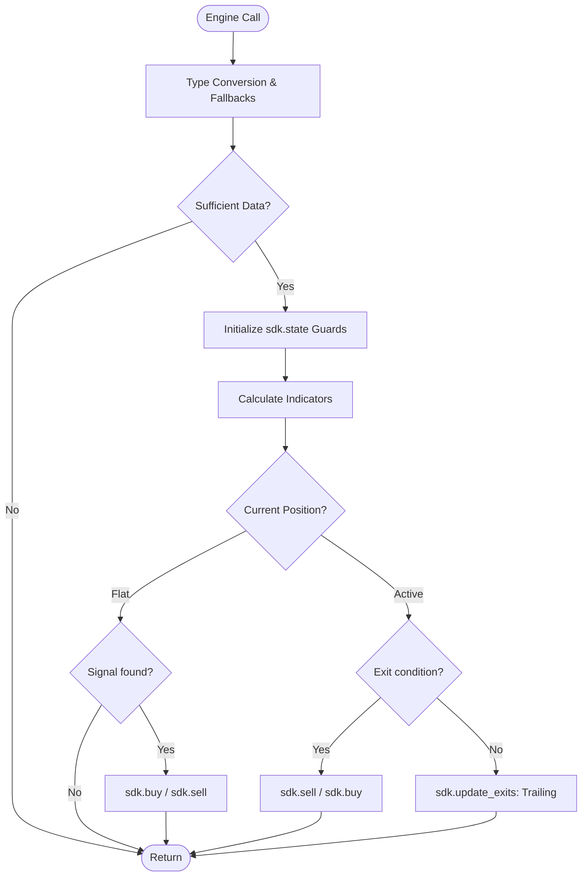

<script setup>
import Tabs from '../../.vitepress/theme/components/Tabs.vue'
</script>

# Solid entry/exit patterns

Practices that reduce bugs and improve the quality of strategies. The items listed derive from errors observed in execution logs, not from theory.

<Tabs :labels="['Solid Template', 'Standard Flow']">
  <template #tab-0>

A defensive scaffold gathering all best practices: type conversion, warmup, state initialization, and explicit exits.

```python
def on_bar_strategy(sdk, params):
    params = params or {}
    fast = int(params.get("fast_period", 9))
    slow = int(params.get("slow_period", 21))
    risk_pct = float(params.get("risk_pct", 0.02))

    # 1. Warmup
    if len(sdk.candles) < max(fast, slow) + 1: return

    # 2. State
    if not isinstance(sdk.state, dict): sdk.state = {}
    if "last_time" not in sdk.state: sdk.state["last_time"] = 0

    # 3. Indicators & Logic
    # ... computation ...

    # 4. ENTRY
    if sdk.position == 0:
        if buy_signal:
            sdk.buy(action="buy_to_open", qty=1, order_type="market")
        elif sell_signal:
            sdk.sell(action="sell_short_to_open", qty=1, order_type="market")

    # 5. EXIT
    elif sdk.position > 0 and exit_signal:
        sdk.sell(action="sell_to_close", qty=abs(sdk.position), order_type="market")
    elif sdk.position < 0 and cover_signal:
        sdk.buy(action="buy_to_cover", qty=abs(sdk.position), order_type="market")
```

  </template>
  <template #tab-1>

Visual representation of the standard execution loop recommended for all TessTrade strategies.



  </template>
</Tabs>

---

## Key Best Practices

### Check `sdk.position` before entering
Without this, the engine silently ignores extra orders if Max Positions = 1.

### Use `qty=abs(sdk.position)` to close
Ensures the entire position is closed, especially important in fractional spot markets.

### Do not use candle indices as timestamps
Always use `sdk.candles[-1]["time"]` for accuracy in timeline alignment.

### Spread `**DECLARATION` in the `df=` branch
When the strategy also draws indicators, `_build_chart` should return
`{**DECLARATION, "series": {...}}` so every metadata field — `pane`, `scale`,
`plots`, `levels` — travels with the data. The legacy
`{"plots": DECLARATION["plots"], "series": {...}}` form forwards only `plots`
and lets the rest fall back to defaults, which silently breaks oscillators
and pane assignment.

```python
def _build_chart(df, params):
    closes = list(df["close"])
    return {
        **DECLARATION,
        "series": {
            "ma_fast": _sma_series(closes, fast),
            "ma_slow": _sma_series(closes, slow),
        },
    }
```
