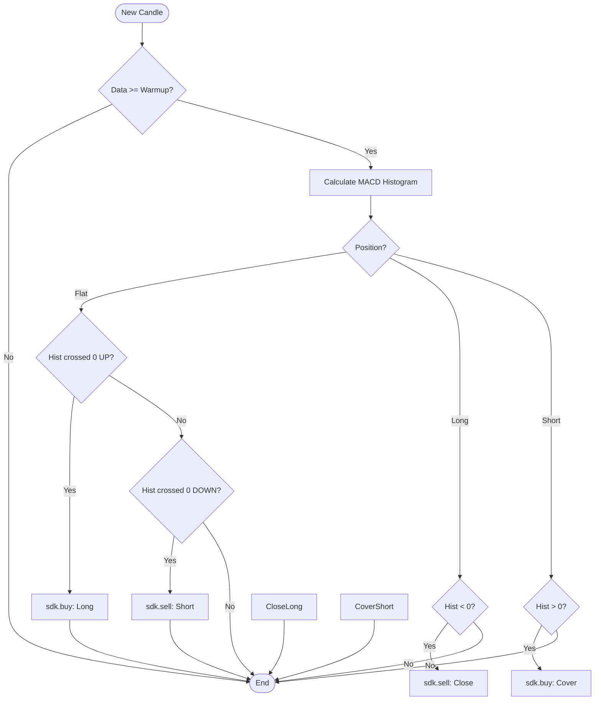

<script setup>
import Tabs from '../../.vitepress/theme/components/Tabs.vue'
</script>

# MACD Momentum

**Momentum** strategy with MACD. The entry occurs on histogram turns. When the histogram crosses zero upward, there is buying strength and the strategy opens long. When it crosses downward, there is selling strength and the strategy opens short.

<Tabs :labels="['Strategy Template', 'Logic Diagram']">
  <template #tab-0>

Standard implementation of the MACD Histogram crossover. Handles EMA calculations and zero-line crossing detection.

```python
DECLARATION = {
    "type": "strategy",
    "inputs": [
        {"name": "fast", "type": "int", "default": 12},
        {"name": "slow", "type": "int", "default": 26},
        {"name": "signal", "type": "int", "default": 9},
    ],
    "plots": [
        {"name": "macd", "title": "MACD", "source": "macd", "type": "line"},
        {"name": "signal_line", "title": "Signal", "source": "signal_line", "type": "line"},
        {"name": "hist", "title": "Histogram", "source": "hist", "type": "histogram"},
    ],
    "pane": "new",
}

def on_bar_strategy(sdk, params):
    fast, slow, sig = int(params.get("fast", 12)), int(params.get("slow", 26)), int(params.get("signal", 9))
    if len(sdk.candles) < max(fast, slow) + sig + 2: return

    hist_prev, hist_curr = _macd_hist_prev_curr([c["close"] for c in sdk.candles], fast, slow, sig)
    crossed_up = hist_prev <= 0 and hist_curr > 0
    crossed_down = hist_prev >= 0 and hist_curr < 0

    if sdk.position == 0:
        if crossed_up: sdk.buy(action="buy_to_open", qty=1, order_type="market")
        elif crossed_down: sdk.sell(action="sell_short_to_open", qty=1, order_type="market")
    elif sdk.position > 0 and crossed_down:
        sdk.sell(action="sell_to_close", qty=abs(sdk.position), order_type="market")
    elif sdk.position < 0 and crossed_up:
        sdk.buy(action="buy_to_cover", qty=abs(sdk.position), order_type="market")
```

  </template>
  <template #tab-1>

Visual representation of the Histogram zero-crossing logic. Captures momentum shifts.



  </template>
</Tabs>

---

## When to use

* **Trending markets with pullbacks.** The histogram captures the moment when the correction ends.
* **Intermediate timeframes (1h, 4h).**

## What to expect

* Earlier signals than SMA crossover, since the histogram reverses before the moving-average crossover.
* More sensitive to noise than SMA in sideways markets.
