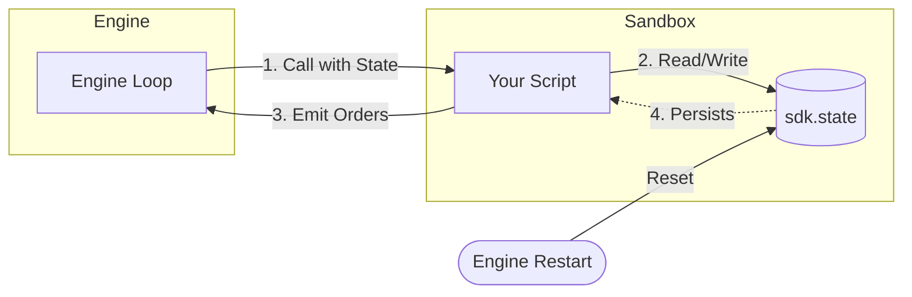

<script setup>
import Tabs from '../../.vitepress/theme/components/Tabs.vue'
</script>

# Persistent state and trailing stop

`sdk.state` is the SDK mechanism for non-trivial strategies. It is a dictionary that the engine keeps alive **between script calls**.

<Tabs :labels="['Usage Patterns', 'State Lifecycle']">
  <template #tab-0>

Common patterns for managing state bar-by-bar, from flags to trailing stops.

```python
def on_bar_strategy(sdk, params):
    # Pattern 1: Initialization
    if not isinstance(sdk.state, dict): sdk.state = {}
    
    # Pattern 2: Trail Stop Logic
    if sdk.position > 0:
        hw = sdk.state.get("high_water")
        sdk.state["high_water"] = max(hw, close) if hw else close
        new_stop = sdk.state["high_water"] * (1 - trail_pct)
        sdk.update_exits(stop_loss=new_stop)
    
    # Pattern 3: Cooldowns
    now = sdk.candles[-1]["time"]
    if now - sdk.state.get("last_entry", 0) < cooldown_ms:
        return
```

  </template>
  <template #tab-1>

Visual flowchart of how data persists across engine calls and restarts.



  </template>
</Tabs>

---

## Principle

**Always initialize keys before using them**, at least for non-numeric objects. Missing numeric keys return `0.0` automatically, which simplifies counters but can hide bugs for lists or dicts.

## Size limit
`sdk.state` lives in sandbox memory subject to the per-strategy memory ceiling. Avoid memory leaks by capping list sizes — see [persistent state](#bounding-collections-in-state) and [sandbox limits](../getting-started/sandbox-limits.md#about-the-memory-limit).
