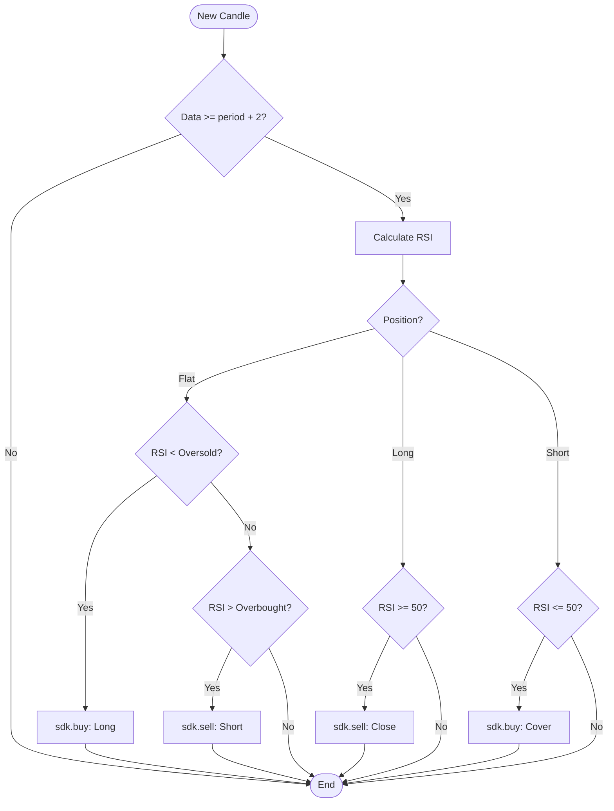

<script setup>
import Tabs from '../../.vitepress/theme/components/Tabs.vue'
</script>

# RSI Mean Reversion

**Mean reversion** strategy with RSI. When the RSI is oversold (below 30), the market has overshot to the downside and the strategy buys expecting a bounce. When overbought (above 70), the market has overshot to the upside and the strategy sells expecting a correction. The exit occurs when the RSI returns to the neutral line (50).

<Tabs :labels="['Strategy Template', 'Logic Diagram']">
  <template #tab-0>

Serves as a starting point for understanding mean reversion. The implementation handles Wilder smoothing and neutral-zone exits.

```python
DECLARATION = {
    "type": "strategy",
    "inputs": [
        {"name": "period", "type": "int", "default": 14},
        {"name": "oversold", "type": "float", "default": 30.0},
        {"name": "overbought", "type": "float", "default": 70.0},
    ],
    "plots": [
        {"name": "rsi", "title": "RSI", "source": "rsi", "type": "line", "color": "#A78BFA"},
    ],
    "pane": "new",
}

def on_bar_strategy(sdk, params):
    period = int(params.get("period", 14))
    oversold = float(params.get("oversold", 30))
    overbought = float(params.get("overbought", 70))

    if len(sdk.candles) < period + 2:
        return

    rsi = _rsi_last([c["close"] for c in sdk.candles], period)
    if rsi is None: return

    if sdk.position == 0:
        if rsi < oversold:
            sdk.buy(action="buy_to_open", qty=1, order_type="market")
        elif rsi > overbought:
            sdk.sell(action="sell_short_to_open", qty=1, order_type="market")
    elif sdk.position > 0 and rsi >= 50:
        sdk.sell(action="sell_to_close", qty=abs(sdk.position), order_type="market")
    elif sdk.position < 0 and rsi <= 50:
        sdk.buy(action="buy_to_cover", qty=abs(sdk.position), order_type="market")
```

  </template>
  <template #tab-1>

Visual representation of the RSI reversion logic. Focuses on oversold/overbought extremes and the 50-level exit.



  </template>
</Tabs>

---

## When to use

* **Sideways or range-bound markets.** Ideal scenario for mean reversion.
* **Assets that tend to revert to the mean.** Blue-chip stocks, range-bound crypto.

## What to expect

* High individual win rate (approximately 60 to 70%), but occasional large losses in strong trends.
* Sensitive to thresholds. `oversold=30, overbought=70` are robust defaults.
