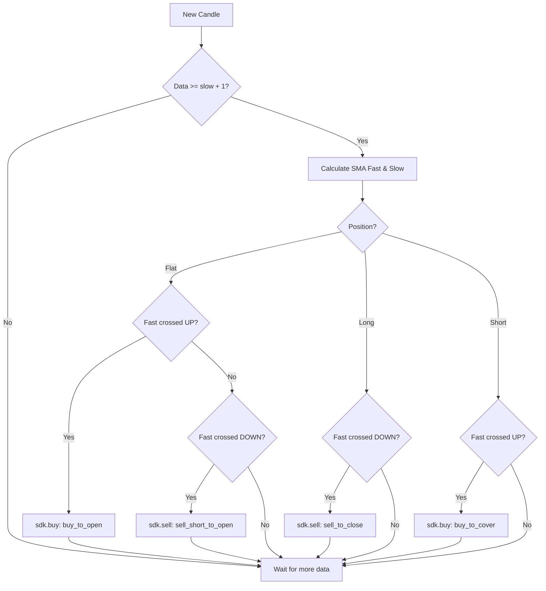

# SMA Crossover

Classic strategy based on two simple moving averages, one fast and one slow. When the fast crosses above the slow, it opens long. When it crosses below, it closes long and opens short. It reverses the position when it crosses back.

::: code-group

```python [Strategy Template]
DECLARATION = {
    "type": "strategy",
    "inputs": [
        {
            "name": "fast_period",
            "label": "Fast Moving Average",
            "type": "int",
            "default": 9,
            "min": 1,
            "max": 100,
            "step": 1,
        },
        {
            "name": "slow_period",
            "label": "Slow Moving Average",
            "type": "int",
            "default": 21,
            "min": 2,
            "max": 200,
            "step": 1,
        },
    ],
    "plots": [
        {
            "name": "ma_fast",
            "title": "Fast SMA",
            "source": "ma_fast",
            "type": "line",
            "color": "#22D3EE",
            "lineWidth": 2,
        },
        {
            "name": "ma_slow",
            "title": "Slow SMA",
            "source": "ma_slow",
            "type": "line",
            "color": "#F59E0B",
            "lineWidth": 2,
        },
    ],
    "pane": "overlay",
}

def on_bar_strategy(sdk, params):
    fast = int((params or {}).get("fast_period", 9))
    slow = int((params or {}).get("slow_period", 21))

    # Warmup: needs at least slow+1 candles to compare two bars.
    if len(sdk.candles) < max(fast, slow) + 1:
        return

    closes = [c["close"] for c in sdk.candles]
    fast_ma = _sma(closes, fast)
    slow_ma = _sma(closes, slow)
    prev_fast = _sma(closes[:-1], fast)
    prev_slow = _sma(closes[:-1], slow)

    # Any None means warmup is still in progress.
    if None in (fast_ma, slow_ma, prev_fast, prev_slow):
        return

    crossed_up = prev_fast <= prev_slow and fast_ma > slow_ma
    crossed_down = prev_fast >= prev_slow and fast_ma < slow_ma

    qty_open = 1
    qty_close = abs(sdk.position)

    if sdk.position == 0:
        if crossed_up:
            sdk.buy(action="buy_to_open", qty=qty_open, order_type="market")
        elif crossed_down:
            sdk.sell(action="sell_short_to_open", qty=qty_open, order_type="market")
    elif sdk.position > 0 and crossed_down:
        sdk.sell(action="sell_to_close", qty=qty_close, order_type="market")
    elif sdk.position < 0 and crossed_up:
        sdk.buy(action="buy_to_cover", qty=qty_close, order_type="market")
```



:::

---

## When to use

* **Markets with strong trend.** The crossover captures the inflection.
* **Medium timeframes (15m, 1h, 4h).** On short timeframes, noise triggers many false signals.

## What to expect

* Long but rare trades. Typically 1 to 4 per week on 1h crypto.
* Drawdown in sideways markets. The crossover keeps oscillating and loses to slippage and fees.
